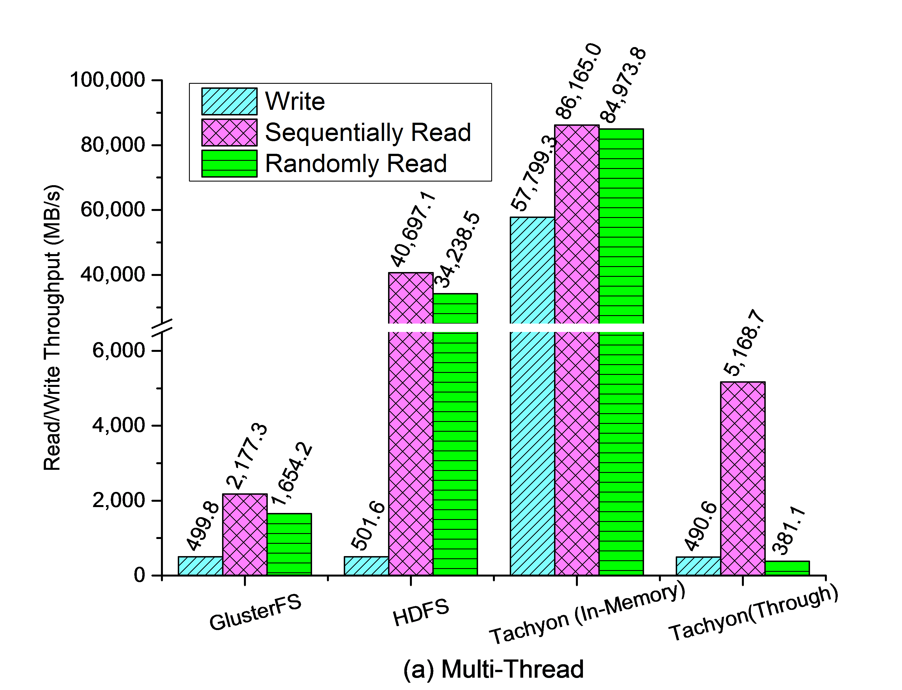
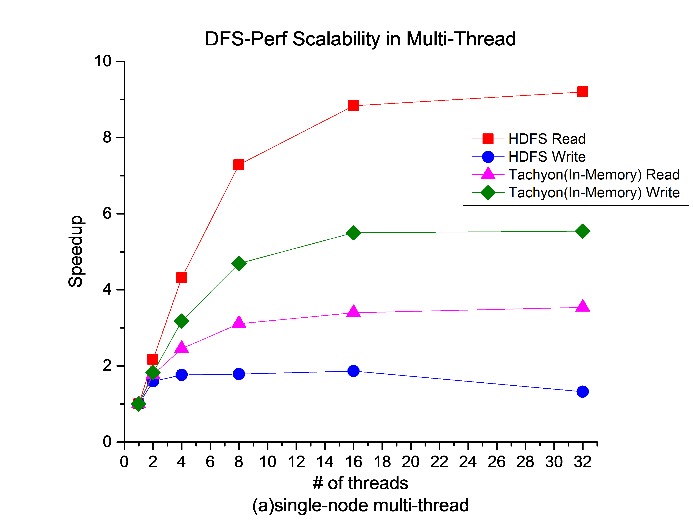
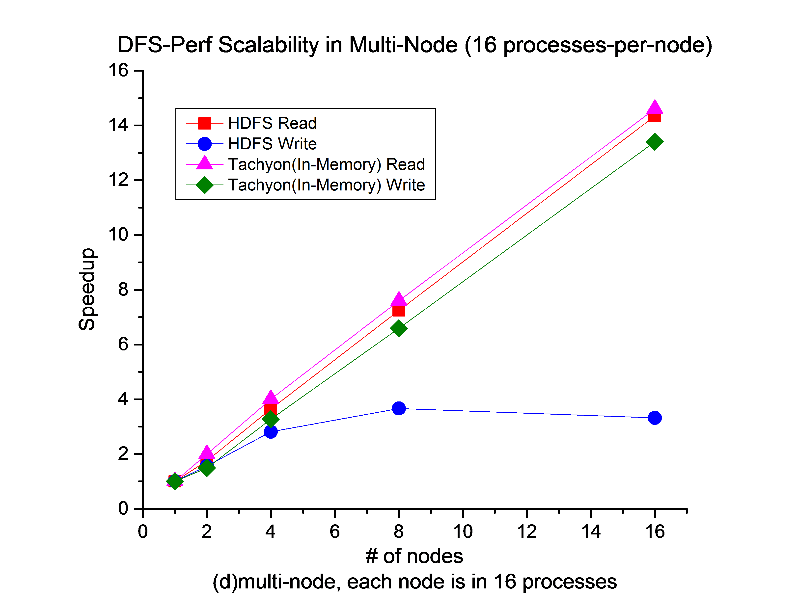

We have evaluated the performance of widely-used representative DFS under different workloads with DFS-Perf. Here is a short report.

# Experimental Setup

    One master node -- two Intel Xeon X5660 CPUs with 64GB memory
    16 slave nodes -- two Intel Xeon E5620 CPUs with 64GB memory
    1Gb/s Ethernet
    
    RHEL 6.0 with Linux 2.6.32, Ext3 file system and Java 1.6.0.
    GlusterFS-3.5.0
    HDFS-2.3.0
    Tachyon-0.6.0-SNAPSHOT

# Basic Performance
## Metadata Performance

 

 

## Read/Write Throughput

 

 

# Scalability

 

 

 

 