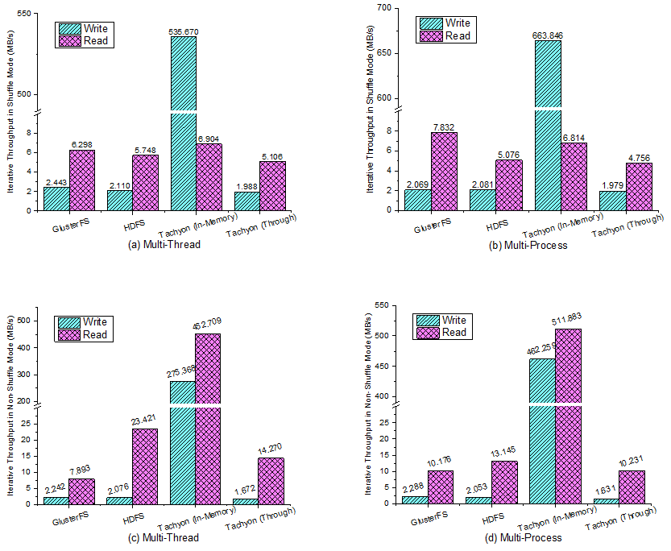

We have evaluated the performance of widely-used representative DFS under different workloads with DFS-Perf. Here is a short report.

# Experimental Setup

    One master node -- two Intel Xeon X5660 CPUs with 64GB memory
    16 slave nodes -- two Intel Xeon E5620 CPUs with 64GB memory
    1Gb/s Ethernet
    
    RHEL 6.0 with Linux 2.6.32, Ext3 file system and Java 1.6.0.
    GlusterFS-3.5.0
    HDFS-2.3.0
    Tachyon-0.6.0-SNAPSHOT

# Basic Performance

Here we take three workloads as examples to show the performance of the single situation. For simplicity, in some figures the label *Tachyon(In-Memory)* denotes in-memory operations of Tachyon and *Tachyon(Through)* means that those operations are going through the underlying file system, i.e., HDFS in our environment, without any in-memory access.

## *Metadata* Workload

**Figure 1: The metadata performance in (a) multi-thread, (b) multi-process. For LocalFS, the value is the performance of a single node and for DFS it is the performance of the whole cluster.**
 

In the metadata workload, we keep requesting metadata operations on each file system and measure the performance as ops-per-sec. In Figure 1, we can see that LocalFS beats others although it is single node. This is because the metadata operations of LocalFS are in single-node memory without any network interaction. While the GlusterFS has the worst performance since it's metadata is decentralized and the metadata information needs to be synchronized over the cluster. On contrast, HDFS and Tachyon are metadata-centralized DFS. They have the similar metadata management thus they gain the similar metadata performance. HDFS is little slower than Tachyon because it generates more journal and edit log data for metadata operations.

Comparing the results of multi-thread and multi-process modes, we find that all the metadata performance increases in multi-process. For LocalFS it increases a lot due to the single-node operation, while for DFS, it only increases a little since the network and the metadata node become the bottleneck.

## *Mixture* Workload

**Figure 2: Mixed Read/Write Throughput. Read Throughput in (a) multi-thread, (b) multi-process. Write Throughput in (c) multi-thread, (d) multi-process. This is the average throughput of each thread/process.**
 

We run mix read/write workload in three kinds of ratios, 80% read - 20% write, 50% read - 50% write and 20% read - 80% write. According to the results in Figure 2, the read and write throughput decreases with the rise of the write ratio. This is reasonable since the DFS have a lower write throughput than the read throughput no matter the data is in the memory, on the disk, or across the network.

The interesting part in this workload is that, both read and write throughput of all the DFS have higher performance in multi-process than multi-thread. This suggests that the application better uses multi-process for better parallelism in these scenarios.

## *Iterate* Workload

**Figure 3: Iterative Throughput. Shuffle Mode in (a) multi-thread, (b) multi-process. Non-Shuffle Mode in (c) multi-thread, (d) multi-process. This is the average throughput of each thread/process.**
 

The performance results of iterative workload are shown in Figure 3. In the *Shuffle* mode, the read operations may be remote, thus the read throughput is limited by the network. In the *Non-Shuffle* mode, the read throughput benefits from the data locality, especially for Tachyon (In-Memory). And on the other side, Tachyon (In-Memory) with the *Non-Shuffle* mode reads and writes both in local memory, thus the write throughput is high than the *Shuffle* mode.

In this workload, GlusterFS’s read and Tachyon’s in-memory operations achieve better performance in multi-process than multi-thread.

# Scalability

Here we evaluate the scalability of DFS-Perf. We take the throughput of HDFS and Tachyon (In-Memory) as the test examples. At first, the workloads are run from 1 to 32 processes/threads on the single node. Then, the same workloads are run from 1 to 16 nodes, both in 16 threads or 16 processes.

**Figure 4: Scalability of DFS-Perf. In single-node we take the value of 1 process x 1 thread as the baseline and in multi-node we take the value of one node as the baseline. (a) single-node multi-thread. (b) single-node multi-process. (c) multi-node, each node is in 16 threads. (d) multi-node, each node is in 16 processes.**
 

The speedup results are shown in Figure 4. From the results we can clearly find the upper bound of the single node. Then, in multi-node mode, the throughput of HDFS is limited by the whole cluster’s network, but Tachyon (In-Memory) achieves a linear scalability because it accesses data only from local memory. All the experimental results show that DFS-Perf has excellent scalability. With the scalability experiments, we can perform stress test to find the threshold or bottleneck of DFS.
