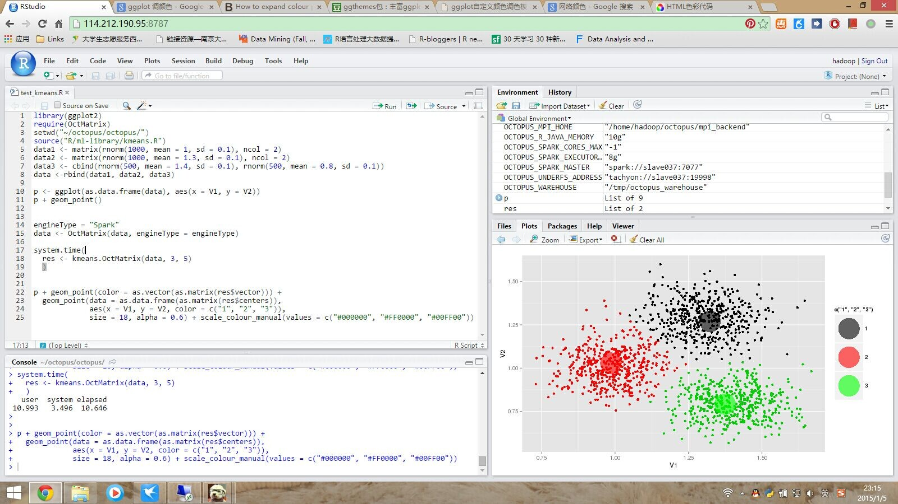

OctMatrix is an R package that can be seamlessly integrated into the R ecosystem. Thus, it can take advantage of the powerful and productive R IDEs, such as RStudio. The picture below shows how it looks like. Users can access the IDE via a web browser on various local platforms, including Windows, Mac, and Linux. They can write or run their programs in the shell command mode and the script batch-processing mode.

    
 
   
After the installation of Octopus, a user only needs to call `require(OctMatrix)` to import the package and use it. The picture below shows adopting the KMeans algorithm built with `OctMatrix` to cluster a 2-D dataset, and then using the `ggplot2` package to demonstrate the clustering results.
  
